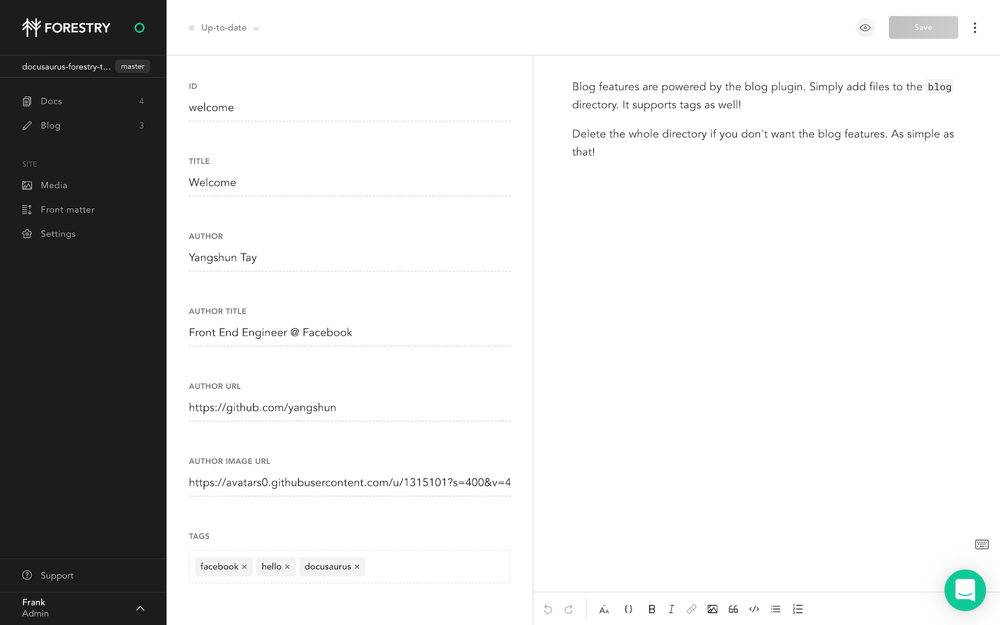

# Docusaurus Forestry starter

Documentation website starter built using [Docusaurus 2](https://v2.docusaurus.io/), a modern static website generator.

## Content Management

This repository is ready to be imported in [Forestry](https://forestry.io), a Git-based CMS, to edit Markdown, JSON files and preview your site before saving changes.

[](https://app.forestry.io/quick-start?repo=DirtyF/docusaurus-forestry-starter&engine=other)



### Installation

```
yarn
```

### Local Development

```
yarn start
```

This command starts a local development server and open up a browser window. Most changes are reflected live without having to restart the server.

### Build

```
yarn build
```

This command generates static content into the `build` directory and can be served using any static contents hosting service.

### Deployment

#### Vercel

[](https://vercel.com/import/git)

Copy-paste your Git repository URL, set build settings and click deploy ✨.

#### GitHub Pages

```
$ GIT_USER=<Your GitHub username> USE_SSH=true yarn deploy
```

If you are using GitHub pages for hosting, this command is a convenient way to build the website and push to the `gh-pages` branch.
